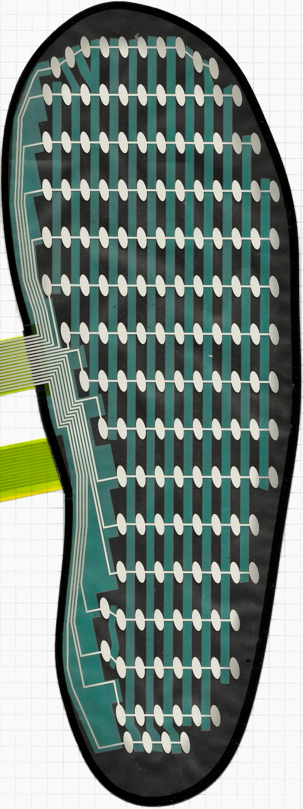
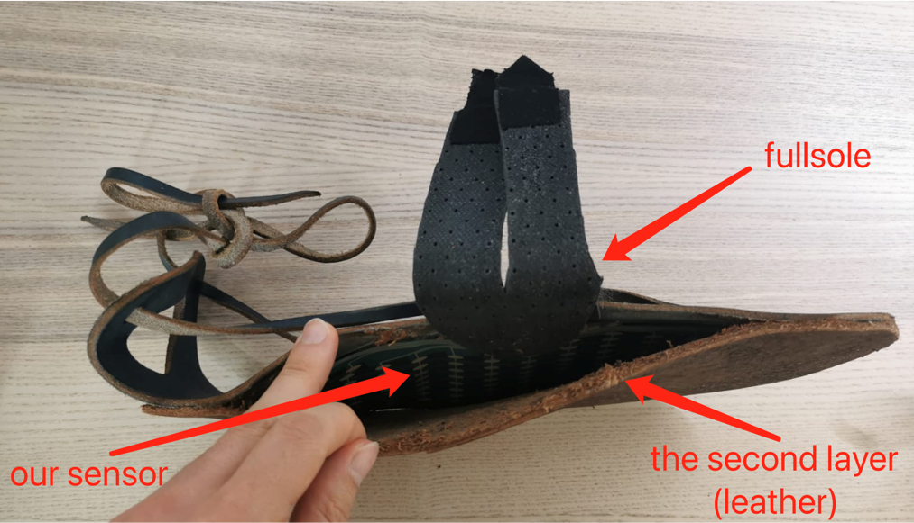

# Title

Our foot pressure sensor blablabla

  
  

# Instructions to replicate our results
## Installing Dependencies
Install all the libraries that are listed in the requirements.txt with your preffered method

## Measuring Data
1. Install the snesor in the fullsoul
2. Connect the controller to both the fullsoul and your pc via usb-c cable
3. Start programm "log_velostat_sesor_h5.py"
4. Walk around and record video with a phone or camera, save in format .mp4 or .mov
5. Close program "log_velostat_sesor_h5.py"

## Visualizing Data
1. Open program "viz_generate_frames.py"
2. Change the location and names of the video and h5 data file (recorded above) in the code to match your folder structure
3. Run program "viz_generate_frames.py"
4. 

# Data
All data we recorded is available in this cloud (lrz sync&share for TUM students): https://syncandshare.lrz.de/getlink/fiNrHQxXBhm1jq8pmnKeAs/

If you have trouble accessing it, please let us know.
We could not use a google drive due to lack of space. 

# Programs
there are a total of 5 python files and 2 folders (config and images):
1. log_velostat_sensor_h5.py: to collect sensor data.
Please ensure that the video is recorded simultaneously to keep the sensor data and the corresponding video synchronized. 
2. index_find.py: 
But if you forgot this, you can use
If you forget to synchronize the walking video and the collected data, you can use this file to determine the correct indices. This script identifies the peak indices in your data, which you can then use to adjust the start and end points in viz_generate_frames.py. Make sure to update lines 80 and 81 of viz_generate_frames.py with these peak indices to ensure proper synchronization between your video and sensor data.
3. velostat_sensor_to_pressure.py

4. viz_generate_frames.py
5. viz_generate_frames.py: to visualize and analyze the sensor data along with the video. This script will process the data from the HDF5 files and the video to provide synchronized visualizations, allowing you to examine the correlation between sensor data and video footage.

# Miscelaneous
Manufacturer contact
Sensor datasheet link etc
