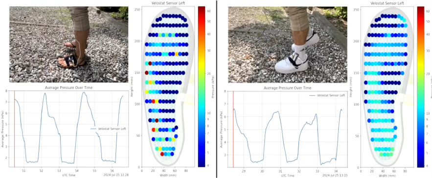

# Foot Sole Pressure Sensing With The Fullsoul

This is our repo for the Clinical Applications of Computation Medicine course, where we were able to measure the foot pressure distribution within a barefoot shoe.

## Idea
Basicall the ultimate goal is to measure the health benefits of barefoot (or barefoot shoes) running. For this course the goal was to use the Velostat sensor shown below in Prof. Dr. Martin Daumer's barefoot shoe the fullsoul, and see if we are able to measure the foot pressure distribution.

  
  
  

## Workflow (Please refer to our video for more details on each step)
1. First step was to try out if the Velostat sensor works, we also wrote our own programs to get the sensor data so that we were not dependent on the manufacturers demo software
2. Then we wanted to understand the concept and we created a proof of concept 3by3 matrix
3. Next we wanted to characterize our sensor, lots and lots of testing
4. Implementation of the sensor in the fullsoul
5. Extensive testing of the fullsoul on different terrain
6. Visualization of the data and synchronization with videos

# Instructions to replicate our results
## Installing Dependencies
Install all the libraries that are listed in the requirements.txt with your preffered method

## Measuring Data
1. Install the snesor in the fullsoul
2. Connect the controller to both the fullsoul and your pc via usb-c cable
3. Start programm "log_velostat_sesor_h5.py"
4. Walk around and record video with a phone or camera, save in format .mp4 or .mov
5. Close program "log_velostat_sesor_h5.py"

## Visualizing Data
1. Synchronize data with video
2. Run index_find.py to get a plot showing each peak’s index (each peak is when the most pressure is on the foot -> when foot is flat).
3. Edit your walking videos to ensure they start and end with the entire (flat) foot on the ground.
4. Open the program viz_generate_frames.py and use the command “python viz_generate_frames.py data/2024-07-25_normal_shoes/nrshoes_left_stone2.h5 data/2024-07-25_normal_shoes/nrshoes_left_stone2.MOV”. Remember to update the file paths and names to match your folder structure.
5. Run the program viz_generate_frames.py, and all the frames will be generated in your output folder.
6. Run frames_to_video.py to create a video from all the frames you generated.

# Data
All data we recorded is available in this cloud (lrz sync&share for TUM students): https://syncandshare.lrz.de/getlink/fiNrHQxXBhm1jq8pmnKeAs/

If you have trouble accessing it, please let us know.
We could not use a google drive due to lack of space. 

# Programs
These are our programs and what each program does. For further information please look at each individual programs docstring!

1. log_velostat_sensor_h5.py: collects sensor data from the Velostat sensors.
   - Remember to modify the port name in line 55 to match your computer's configuration.
   - Ensure that the video is recorded simultaneously with the sensor data to keep them synchronized.
2. index_find.py:
   - If you forget to synchronize the walking video with the collected data, use this script to determine the correct indices for synchronization. It identifies the peak indices in your data, which you can then use to adjust the start and end points in viz_generate_frames.py.
   - Additionally, this script helps you edit the video by cutting it from the first peak to the last peak (when you are fully on your foot).
   - Update lines 80 and 81 of viz_generate_frames.py with these peak indices to ensure proper synchronization between your video and sensor data.
3. velostat_sensor_to_pressure.py: provides a function to convert Velostat sensor output values to pressure in Pascals using linear interpolation.
   - No modifications are needed for this script. The function is modular and directly used by viz_generate_frames.py.
4. viz_generate_frames.py: visualizes and analyzes sensor data alongside the video.
   - This script generates frames of the walking process, featuring three subplots: the entire walking process on the top left, the average pressure across the entire foot over time on the bottom left, and the pressure recorded at each sensor point over time on the right.
5. frames_to_video.py: creates an animation from the generated frames.
   - Always remember to update the folder paths according to your specific requirements.

# Miscelaneous
Manufacturer contact
Sensor datasheet link etc
